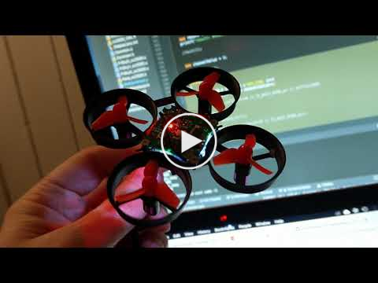
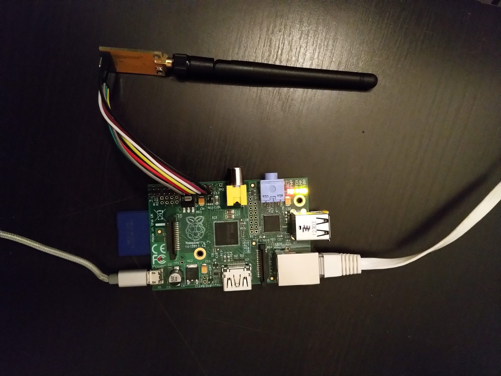

# FrSky Compatible Transmitter for Raspberry Pi

## Project Goal

Control a RC model with an FrSky receiver using a joystick and rudder pedals connected to a Raspberry Pi single-board computer.

A CC2500 module is connected to the the Raspberry Pi using the SPI bus to send FrSky compatible signals. A USB joystick, throttle control and rudder pedals will be connected to the Raspberry Pi to receive control inputs.

The FrSky transmitter code is ported from [DIY Multiprotocol TX Module](https://github.com/pascallanger/DIY-Multiprotocol-TX-Module) project.

## Project status

Functioning SPI connection from between the Raspberry Pi and the [CC2500+PA+LNA 2.4G SPI 22dBm Wireless Data Transceiver Module CC2500 Module](https://www.aliexpress.com/item/CC2500-PA-LNA-2-4G-SPI-22dBm-Wireless-Data-Transceiver-Module/32606419424.html).


A a FrSky compatible receiver using the FRSKY_D protocol can be bound:
[](https://www.youtube.com/watch?v=Y9kTib8ejkA)

### Todo
* ~~Connect Raspberry Pi to CC2500 module using SPI bus~~
* ~~Bind receiver~~
* Send frequency hoping data packets from FrPi to receiver
* Write code to receive inputs from USB joystick

## Requirements

* Raspberry Pi single-board computers
* A CC2500 module
* USB joystick / rudder pedals

Tested with:
* Raspberry Pi Model B Rev 2
* [CC2500+PA+LNA 2.4G SPI 22dBm Wireless Data Transceiver Module CC2500 Module](https://www.aliexpress.com/item/CC2500-PA-LNA-2-4G-SPI-22dBm-Wireless-Data-Transceiver-Module/32606419424.html)


# Setup

## Install dependencies

```
sudo apt install git cmake wiringpi
```

## Set up SPI bus on Raspberry Pi

```
sudo raspi-config
```

Select:

* 5.Interfacing Options
* P4 SPI
* YES
* OK
* Finish

## Connect module

| Raspberry Pi Physical Pin	     | CC2500 PIN 	|  
|---	                           |---	        |
|   15 / BCM 22 / WiringPi pin 3 | GDO2	/  GD2*
|   17 / 3v3 Power               | 3.3V	/ VCC
|   19 / SPI0 MOSI 	             | MOSI	/ SI
|   21 / SPI0 MISO               | MISO / SO
|   23 / SPI0 SCLK               | RFSCL / SCLK
|   24 / SPI0 CE0                | RFCS	 / CSN
|   25 / GND                     | GND

 \* GDO2 is currently not used





## Build software
```
git clone https://github.com/alexbirkett/FrPi.git
cd FrPi/src
mkdir build
cd build
cmake ..
make
```

## Run FrPi

On the first Raspberry Pi:

From the `FrPi/src/build` directory:

```
./frpi
```
